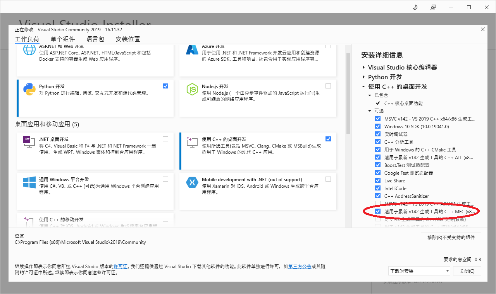
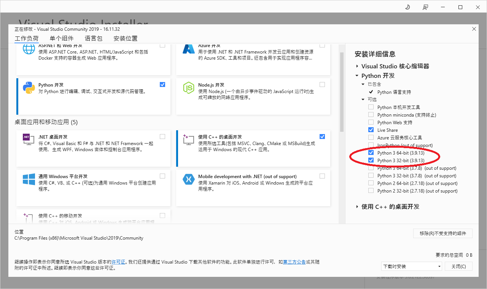

### 4.1.2 [vs 2019](https://github.com/ChineseInputMethod/weasel/blob/master/doc/4.1%20build/4.1.2%20vs%202019/vs%202019.md)

2023/11/18，作者开始编写本章时间点，最好使用Visual Studio 2019编译本仓库。（Visual Studio 2022需要安装v142工具集）

如下图所示，添加MFC组件：

如下图所示，添加Python组件：

