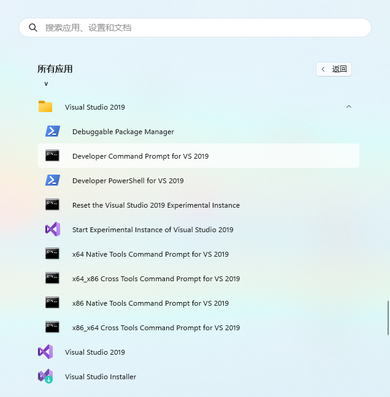
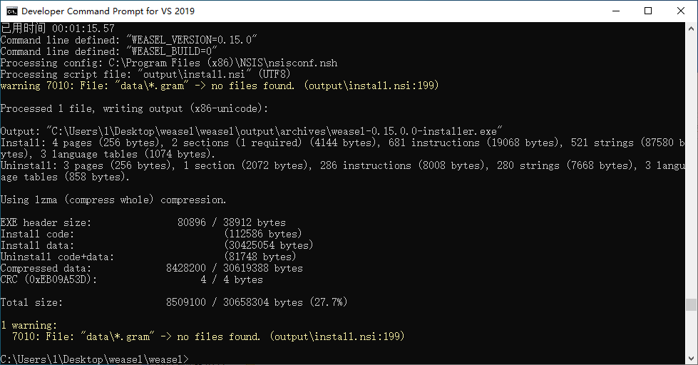

### 4.1.4 [build](https://github.com/ChineseInputMethod/weasel/blob/master/doc/4.1%20build/4.1.4%20build/build.md)

修改/weasel文件夹里env.vs2022.bat文件，设置boost库路径，配置编译环境。

```batch
rem Customize your build environment and save the modified copy to env.bat

set WEASEL_ROOT=%CD%

rem REQUIRED: path to Boost source directory
set BOOST_ROOT=boost库路径

rem OPTIONAL: architecture, Visual Studio version and platform toolset
rem set ARCH=Win32
set BJAM_TOOLSET=msvc-14.3
set CMAKE_GENERATOR="Visual Studio 17 2022"
set PLATFORM_TOOLSET=v143

rem OPTIONAL: path to additional build tools
set DEVTOOLS_PATH=%ProgramFiles%\Git\cmd;%ProgramFiles%\Git\usr\bin;%ProgramFiles%\CMake\bin;
```

将修改后的env.vs2022.bat文件，另存为env.bat

```batch
copy env.vs2022.bat env.bat
```

打开vs编译环境。



进入/weasel目录，执行build.bat

```batch
build all
```

如下图所示，即为完整编译成功。



如果在build最后一步打包安装程序时报错，执行如下命令，确保打包数据完整。（由于网络问题，这步经常出错）

```batch
build data
```
