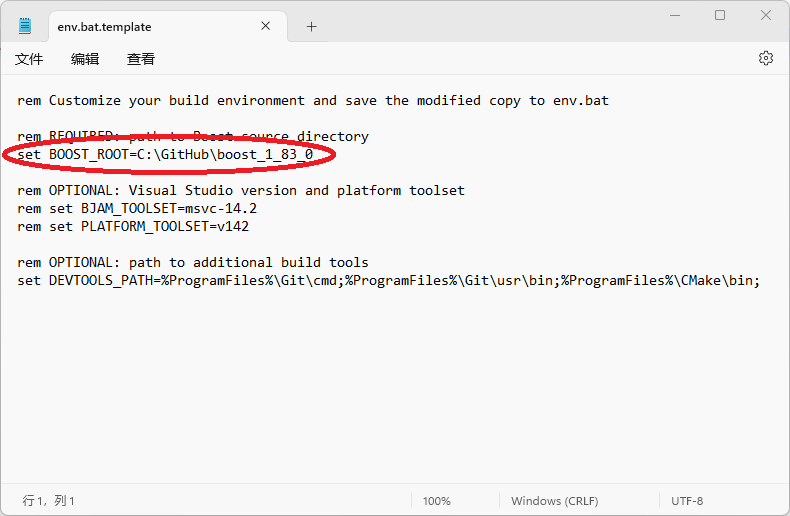

### 4.1.4 [build](https://github.com/ChineseInputMethod/weasel/blob/master/doc/4.1%20build/4.1.4%20build/build.md)

修改/weasel文件夹里env.bat.template文件，设置boost库路径。



将/weasel/librime文件夹里env.bat.template文件，另存为env.bat

```batch
copy env.bat.template env.bat
```

打开vs编译环境。


进入/weasel目录，执行build.bat

```batch
build all
```

如下图所示，即为完整编译成功。

