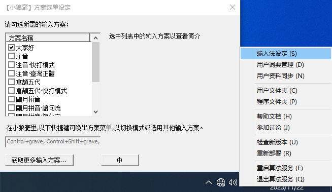
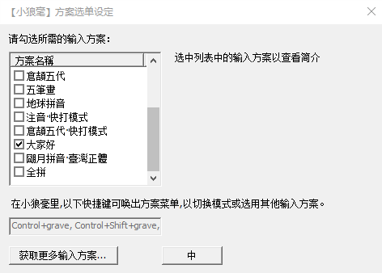

### 4.2.1 [中州韵输入法引擎](https://github.com/ChineseInputMethod/weasel/blob/master/doc/4.2%20customization/4.2.1%20rime/rime.md)

中州韵输入法引擎是跨平台的输入法引擎。小狼毫输入法是使用中州韵引擎开发的Windows系统输入法。

官方文档在`https://rime.im/docs/`。
我参考其中`https://github.com/rime/home/wiki/RimeWithSchemata#%E7%B6%9C%E5%90%88%E6%BC%94%E7%B7%B4`部分，编写了本小节。

在上一节编译成功后，会在/weasel/output/archives文件夹，生成weasel-*.*.*.*-installer.exe小狼毫安装程序。
运行安装程序，安装小狼毫输入法。

#### 4.2.1.1 定制小狼毫

新建`hello.schema.yaml`文件，粘贴以下内容：

```
# Rime schema
# encoding: utf-8
#
# 最簡單的 Rime 輸入方案
#

schema:
  schema_id: hello    # 注意此ID與文件名裏 .schema.yaml 之前的部分相同
  name: 大家好         # 將在〔方案選單〕中顯示
  version: "1"        # 這是文字類型而非整數或小數，如 "1.2.3"
```

>注意编码格式为utf-8，缩进为两个半角空格。

在小狼毫图标上右键，打开输入法菜单，打开用户文件夹，将`hello.schema.yaml`文件，保存到用户文件夹。


点击输入法菜单->输入法设定，打开设置窗口，勾选刚刚保存的“大家好”方案。



然后点击输入法菜单->重新部署，就可以测试刚刚定制好的方案了。

>每次修改方案，都要重新部署。

#### 4.2.1.2 *.schema.yaml

定制一个输入法一般需要修改两个文件。

file				|Description
-|-
*.schema.yaml		|方案，输入法的设计方案。
*.dict.yaml			|词典，输入法的码表文件。

现在继续修改`hello.schema.yaml`文件。

```
# Rime schema
# encoding: utf-8
#
# 最簡單的 Rime 輸入方案
#

schema:
  schema_id: hello    # 注意此ID與文件名裏 .schema.yaml 之前的部分相同
  name: 大家好         # 將在〔方案選單〕中顯示
  version: "2"        # 這是文字類型而非整數或小數，如 "1.2.3"

engine:
  processors:
    - speller          # 把字母追加到編碼串
    - express_editor   # 空格確認當前輸入、其他字符直接上屏
  segmentors:
    - abc_segmentor    # 標記輸入碼的類型
  translators:
    - echo_translator  # （無有其他結果時，）創建一個與編碼串一個模樣的候選項
```

现在这个输入法实现了：以小写字母做为编码、以空格键做为选择键、以当前编码做为候选字词（英文输入）。

#### 4.2.1.3 *.dict.yaml

修改`hello.schema.yaml`文件。

```
# Rime schema
# encoding: utf-8
#
# 最簡單的 Rime 輸入方案
#

schema:
  schema_id: hello    # 注意此ID與文件名裏 .schema.yaml 之前的部分相同
  name: 大家好         # 將在〔方案選單〕中顯示
  version: "3"        # 這是文字類型而非整數或小數，如 "1.2.3"

engine:
  processors:
    - speller          # 把字母追加到編碼串
    - express_editor   # 空格確認當前輸入、其他字符直接上屏
  segmentors:
    - abc_segmentor    # 標記輸入碼的類型
  translators:
    - echo_translator  # （無有其他結果時，）創建一個與編碼串一個模樣的候選項
    - script_translator    # 腳本翻譯器

translator:
  dictionary: hello       # 設定 script_translator 使用的詞典名
```

这次在`hello.schema.yaml`文件中添加了码表组件。

新建`hello.dict.yaml`文件，粘贴以下内容：

```
# Rime dictionary
# encoding: utf-8

---
name: hello
version: "1"
sort: original
...

大家好	hello
再見	bye
再會	bye

星期一	monday
星期二	tuesday
星期三	wednesday
星期四	thursday
星期五	friday
星期六	saturday
星期日	sunday

星期一	weekday
星期二	weekday
星期三	weekday
星期四	weekday
星期五	weekday
星期六	weekday
星期日	weekday
```

将`hello.dict.yaml`文件保存至`hello.schema.yaml`所在文件夹。

现在`大家好`这个方案，实现了输入法的基本功能。

#### 4.2.1.4 组件

组件含义，参见`https://github.com/LEOYoon-Tsaw/Rime_collections/blob/master/Rime_description.md`。

可以观察到，中州韵输入法引擎，是在`*.schema.yaml`文件里添加`组件`，实现输入法功能的。

例如，想要实现数字键选择候选字词，在如下位置添加`selector`组件，即可实现。

```
engine:
  processors:
    - speller
    - selector         # 選字、換頁
    - express_editor
```

有时实现一个功能，需要添加多个相关组件。

例如，想要实现中文标点符号输入，需要在`schema/processors`段落，添加`punctuator`组件。告诉输入法引擎，本方案需要处理符号键。

在`schema/segmentors`段落，添加`punct_segmentor`组件。告诉输入法引擎，将符号做为编码串的切分。

在`schema/translators`段落，添加`punct_translator`组件。告诉输入法引擎，要对符号进行转换。并在`punctuator`段落，导入`default`符号表。

下面是实现上述功能的`hello.dict.yaml`文件内容。

```
# Rime schema
# encoding: utf-8
#
# 最簡單的 Rime 輸入方案
#

schema:
  schema_id: hello    # 注意此ID與文件名裏 .schema.yaml 之前的部分相同
  name: 大家好         # 將在〔方案選單〕中顯示
  version: "4"        # 這是文字類型而非整數或小數，如 "1.2.3"

engine:
  processors:
    - speller          # 把字母追加到編碼串
    - punctuator       # 處理符號按鍵
    - selector         # 選字、換頁
    - express_editor   # 空格確認當前輸入、其他字符直接上屏
  segmentors:
    - abc_segmentor    # 標記輸入碼的類型
    - punct_segmentor  # 劃界，與前後方的其他編碼區分開
  translators:
    - echo_translator  # （無有其他結果時，）創建一個與編碼串一個模樣的候選項
    - punct_translator # 轉換
    - script_translator    # 腳本翻譯器

translator:
  dictionary: hello     # 設定 script_translator 使用的詞典名
  
punctuator:             # 設定符號表，這裏直接導入預設的
  import_preset: default
```

#### 4.2.1.5 打包输入法

将编辑好的`hello.schema.yaml`和`hello.dict.yaml`文件，保存到`/weasel/output/data`文件夹。

打开vs命令行编译环境。

进入/weasel目录，执行build.bat

```batch
build installer
```

编译后，会在/weasel/output/archives文件夹，生成weasel-*.*.*.*-installer.exe小狼毫安装程序。

卸载已安装的小狼毫输入法，安装新生成的安装程序。
如图所示，本小节编辑的输入法已打包到了安装程序中。

