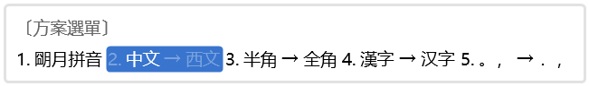

### 4.2.2 [yaml](https://github.com/ChineseInputMethod/weasel/blob/master/doc/4.2%20customization/4.2.2%20yaml/weasel.md)

本小节讲解YAML基本语法，完善“大家好”这个输入法方案。

为了节约篇幅，方便阅读，每个专题只展示了相关部分的代码，完整的代码放在了本小节最后。

#### 4.2.2.1 注释

`yaml`文件，使用#号注释内容。从#号处开始至本行结束，均为注释内容。
`yaml`只支持单行注释。

```
# Rime schema
# encoding: utf-8
#
# 最簡單的 Rime 輸入方案
#
```

上面代码提醒使用者，rime引擎使用utf-8格式的文件。

#### 4.2.2.2 缩进

`yaml`文件，使用缩进表示层级关系，缩进不允许使用tab，只允许空格。缩进的空格数不重要，只要相同层级的元素左对齐即可。

```
schema:
  name: 大家好            # 將在〔方案選單〕中顯示
  schema_id: hello       # 注意此ID與文件名裏 .schema.yaml 之前的部分相同
  version: "5"           # 這是文字類型而非整數或小數，如 "1.2.3"
```

在上面的代码中，`name`、`schema_id`、`version`为同一层级，均在`schema`层级下。
`schema`被`rime`开发者称为描述档，在该层级下，描述了当前`schema.yml`文件的基本信息。

初学者常见的一个错误是，复制粘贴其他`schema.yml`文件代码，没有注意缩进对齐，导致层级错误。

#### 4.2.2.3 映射

像`name: 大家好`这样，标签后跟一个冒号和空格，然后是内容，在Yaml中被称为键值对。
也就是数据结构中的映射关系。

`name`是键，`大家好`是键映射的值，`: `是键与值之间的分隔符。

```
  name: 大家好            # 將在〔方案選單〕中顯示
  schema_id: hello       # 注意此ID與文件名裏 .schema.yaml 之前的部分相同
  version: "5"           # 這是文字類型而非整數或小數，如 "1.2.3"
```

上面的代码，包含了三个键值对。值可以是原始数据类型，例如字符串，整数，布尔值等等。也可以是复合数据类型。

```
schema:
  name: 大家好            # 將在〔方案選單〕中顯示
  schema_id: hello       # 注意此ID與文件名裏 .schema.yaml 之前的部分相同
  version: "5"           # 這是文字類型而非整數或小數，如 "1.2.3"
```

例如上面的代码，键`schema`的值是三个键值对。

#### 4.2.2.4 列表

`-`减号后跟一个` `空格，然后跟一个内容，被称为数组，也就是数据结构中的列表。

```
  processors:
    - speller            # 把字母追加到編碼串
    - punctuator         # 處理符號按鍵
    - selector           # 選字、換頁
    - express_editor     # 空格確認當前輸入、其他字符直接上屏
```

上面的代码中，键`processors`的值是一个列表，列表包含了四个元素。
在其他教程中，上面的代码也被解释为，`processors`是一个包含了四个元素的数组。

列表的另一种书写格式为：[元素1,元素2,元素3]。
下面的代码含义与上面的代码是等价的。

```
  processors: [speller,punctuator,selector,express_editor]
```

列表有两种书写方式，是为了方便阅读。（映射也有另外一种书写方式，本教程不涉及此格式）

```
switches:
  - name: ascii_mode
    reset: 0
    states: [中文,西文]
  - name: full_shape
    states: [半角,全角]
  - name: simplification # 轉換開關
    states: [漢字,汉字]
```

例如上面的代码，键`switches`的值是一个包含了三个元素的列表。第一个元素包含了三个映射，其中第三个映射`states`的值是一个包含了两个元素的列表`中文,西文`。
在涉及到列表嵌套的场景里，这种书写方式，更方便阅读。

上面的代码在rime里的含义是，`switches`被称为开关档，这里包含了一些输入法设置开关，可以切换输入法状态。
切换到小狼毫输入法，按下`Ctrl`+```键，如下图所示，该设置实现了传统输入法的状态条功能。



#### 4.2.2.5 文档

在Yaml中三个减号`---`的含义是标记文档的开始，三个句点`...`的含义是标记文档的结尾。
在Rime中`---`和`...`用于标记词典文件的词典配置。

```
---
name: hello
version: "2"
sort: original
...
```

上面的代码含义是`---`和`...`之间是词典的配置内容。`...`之后是码表。

下面是本小节`hello.dict.yaml`文件的完整内容。

```
# Rime dictionary
# encoding: utf-8

---
name: hello
version: "2"
sort: by_weight
...

大家好	hello
再見	bye
再會	bye

星期一	monday
星期二	tuesday
星期三	wednesday
星期四	thursday
星期五	friday
星期六	saturday
星期日	sunday

星期一	weekday
星期二	weekday
星期三	weekday
星期四	weekday
星期五	weekday
星期六	weekday
星期日	weekday
```

下面是本小节`hello.schema.yaml`文件的完整内容。

```
# Rime schema
# encoding: utf-8
#
# 最簡單的 Rime 輸入方案
#

schema:
  name: 大家好            # 將在〔方案選單〕中顯示
  schema_id: hello       # 注意此ID與文件名裏 .schema.yaml 之前的部分相同
  version: "5"           # 這是文字類型而非整數或小數，如 "1.2.3"

switches:
  - name: ascii_mode
    reset: 0
    states: [中文,西文]
  - name: full_shape
    states: [半角,全角]
  - name: simplification # 轉換開關
    states: [漢字,汉字]
    
engine:
  processors:
    - speller            # 把字母追加到編碼串
    - punctuator         # 處理符號按鍵
    - selector           # 選字、換頁
    - express_editor     # 空格確認當前輸入、其他字符直接上屏
  segmentors:
    - abc_segmentor      # 標記輸入碼的類型
    - punct_segmentor    # 劃界，與前後方的其他編碼區分開
  translators:
    - echo_translator    # （無有其他結果時，）創建一個與編碼串一個模樣的候選項
    - punct_translator   # 轉換
    - script_translator  # 腳本翻譯器

translator:
  dictionary: hello      # 設定 script_translator 使用的詞典名
  
punctuator:              # 設定符號表，這裏直接導入預設的
  import_preset: default
```

将`hello.schema.yaml`和`hello.dict.yaml`文件保存到`用户文件夹`。
在`输入法设定`中选中`大家好`，即可测试本小节编辑的输入法方案。