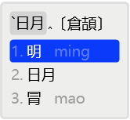
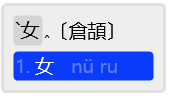

### 4.2.4 [regex](https://github.com/ChineseInputMethod/weasel/blob/master/doc/4.2%20customization/4.2.4%20regex/custom.md)

本小节讲解正则表达式，制作一个双拼输入法。

本小节相关文件，放在了[附录 A](https://github.com/ChineseInputMethod/weasel/tree/master/doc/appendix/hello)中。

#### 4.2.4.1 正则表达式

正则表达式用于根据某种规则从源字符串中，匹配出目标字符串。

最简单的匹配是完全匹配。
例如正则表达式a会在字符串"axabyabcz"中匹配出三个结果。
ab会在字符串"axabyabcz"中匹配出两个结果。
abc在字符串"axabyabcz"中只有一个匹配结果。

中括号[]表示选择匹配。
例如[ab]，表示匹配a或b，在字符串"axabyabcz"中，有五个匹配结果。

选择匹配和选择匹配可以组合使用。
例如[ab]\[xyz\]，表示匹配ax、ay、az、bx、by、bz这样的结果。

选择匹配一般和完全匹配组合使用。
例如[ab]x，表示匹配ax或bx。

中括号[]还用于表示范围集合。当在[]中用连字符-连接两个字符时，表示两个字符之间的任意字符。
例如[a-z]，表示从字母a到字母z的任意字母。

\`[a-z]表示匹配：\`a、\`b、\`c……这样的组合。

星号*表示重复前一个匹配零次或多次。
例如a*表示：(空)、a、aa、aaa、aaaa……这样的字符串。
[ab]*表示：(空)、a、b、aa、ab、bb、ba、aaa、aba……这样的字符串。

插入符^表示从字符串左边界开始匹配。
例如^abc在字符串"axabyabcz"中没有匹配结果。

美元符号$表示匹配到字符串的右边界。
例如abc$在字符串"axabyabcz"中没有匹配结果。

\`[a-z]*$表示：以\`a、\`ab、\`xyz……这样结尾的字符串。

```
recognizer:
  import_preset: default
  patterns:
    reverse_lookup: "`[a-z]*$"
```

在上面的代码中，标识器组件`recognizer`，将从反引号\`开始到字符串结尾的编码串标记为编码反查段`reverse_lookup`。
例如输入：\`ab，反查翻译器`reverse_lookup`将会显示仓颉编码为ab的汉字。

#### 4.2.4.2 动态编码

传统的形码输入法可以等同于静态的汉字编码，其主要内容是将汉字放到码长为N的N维空间中。
平均码长和重码率是衡量一款形码输入法的重要指标。每一张码表都是经过精心设计的。
这样，在潜移默化中形码设计人形成了一种偏执，希望汉字和编码形成一一对应的映射关系。

为什么很多形码输入法有很多硬性的无理拆分呢？因为如果进行有理拆分或设置容错码，就会破坏这张经过精心设计的码表。
假设一个汉字有两个编码，这样的汉字组成两字词就需要四倍编码空间，组成三字词就需要八倍编码空间。
设置容错码会很快耗尽编码空间。

而拼音输入法不存在这个问题（可以看成天然无法消除重码而摆烂）。对应形码的容错码，在拼音输入法中有模糊音和多音字。
假设一个汉字有两个读音，这样的汉字组成两字词并不需要四倍的编码空间。因为用户一般只会用四个组合中的一组读音来输入这个两字词。
这就是静态编码和动态编码的区别。

形码输入法的码表都是预先编写完成的，扩充码表往往会破坏其结构。因为其映射关系都对应着编码规则，码表是按照编码规则优化的，两者是交织在一起的。
而拼音输入法因为动态编码的原因，几乎拥有无限造词能力。形码输入法的设计理念是，如果我把单字都设计成不重码了，那么就是无限的造词造句能力。
形码发明人一直禁锢在这个理念之中。

在rime中动态编码被称为拼写运算。
拼写运算的格式为：<運算子><分隔符><參數1><分隔符><參數2><分隔符>...
例如：xlit/abc/ABC/
运算子为xlit，分隔符为/，参数为abc和ABC

>运算子可以看成操作符或函数，拼写运算一般是带两个参数的二元函数。

最简单的拼写运算是xlit（转写），其含义是：将第一个参数中的字符一一对应的转写为第二个参数中的字符。

```
reverse_lookup:
  dictionary: cangjie5
  prefix: "`"
  tips: 〔倉頡〕
  preedit_format:        #回显输入编码
    - "xlit|abcdefghijklmnopqrstuvwxyz|日月金木水火土竹戈十大中一弓人心手口尸廿山女田難卜符|"
```

上面的代码实现了将输入窗口的输入编码回显为对应的仓颉键名。
例如输入`ab，a被转写为“日”，b被转写为“月”。



#### 4.2.4.3 拼写运算

拼写运算的完整介绍，参见[拼寫運算詳解](https://github.com/rime/home/wiki/SpellingAlgebra)。

Algebra	|Description
-|-
xlit	|转写
xform	|变形
erase	|消除
derive	|派生
fuzz	|模糊
abbrev	|缩略

除转写和消除外，其余四个拼写运算都运用到了正则表达式的引用替换概念。

以括号()包围起的表达式在正则表达式中被称为子表达式。美元符号$后加数字是对子表达式的引用。
例如：([nl])ue，([nl])就是子表达式，$1表示引用子表达式[nl]。

子表达式可以组合嵌套。美元符号$后的数字表示子表达式左括号(，从左到右在字符串中位置的索引。
例如：(([nl])ue)，$1表示子表达式[nl]ue，$2表示子表达式[nl]

```
reverse_lookup:
  dictionary: cangjie5
  prefix: "`"
  tips: 〔倉頡〕
  preedit_format:        #回显输入编码
    - "xlit|abcdefghijklmnopqrstuvwxyz|日月金木水火土竹戈十大中一弓人心手口尸廿山女田難卜符|"
  comment_format:
    - xform/([nl])v/$1ü/ #显示编码查询
```

以上代码实现了将码表中nv、lv这样的汉语拼音编码，变形（引用替换）为nü、lü这样的汉语拼音方案字母显示在候选窗口中。



#### 4.2.4.4 投影算法

通过若干拼写运算的集合，一种编码方案可以衍生出另一种编码方案。例如可以从全拼方案中，衍生出双拼方案。
通过对声母和韵母的引用替换，可以生成单字的编码方案，通过单字的编码方案，可以生成词组的编码方案。

在拼写运算规则`algebra`节点中，有若干拼写运算。

```
speller:
  alphabet: zyxwvutsrqponmlkjihgfedcba  # 呃，倒背字母表完全是個人喜好
  delimiter: " '"  # 隔音符號用「'」；第一位的空白用來自動插入到音節邊界處
  algebra:  # 拼寫運算規則，這個纔是實現雙拼方案的重點。寫法有很多種，當然也可以把四百多個音節碼一條一條地列舉
```

rime将这些拼写运算编译为棱镜`prism`文件，与`hello`词库的二进制文件形成映射关系。拼写运算的迭代过程在rime中被称为投影算法。

```
translator:
  dictionary: hello     # 與【大家好】共用詞典
  prism: double_pinyin_abc    # prism 要以本輸入方案的名稱來命名，以免把朙月拼音的拼寫映射表覆蓋掉
```

>上述文件在用户文件夹/build目录里。

可能有读者会产生疑问，为什么不直接把全拼词库中的音节，替换成双拼编码呢。为什么不单独制作一个双拼词库呢。
如果只包含几种方案，且方案均以成熟，确实可以这样做，而且这样做运行效率会比拼写运算效率高。

但rime是个平台，可能包含了多人协作的多种方案。使用拼写运算，其一，利于共享成果。其二，方便修改方案。

#### 4.2.4.5 双拼方案

在`algebra`节点中包含若干拼写运算，rime通过拼写运算将双拼编码映射到全拼词库上。从而将“大家好”这个全拼输入法，衍生出一个双拼输入法。

`erase/^xx$/`删除无关音节。`derive/^([jqxy])u$/$1v/`设置容错码。

```
speller:
  alphabet: zyxwvutsrqponmlkjihgfedcba  # 呃，倒背字母表完全是個人喜好
  delimiter: " '"  # 隔音符號用「'」；第一位的空白用來自動插入到音節邊界處
  algebra:  # 拼寫運算規則，這個纔是實現雙拼方案的重點。寫法有很多種，當然也可以把四百多個音節碼一條一條地列舉
    - erase/^xx$/             # 碼表中有幾個拼音不明的字，編碼成xx了，消滅他
    - derive/^([jqxy])u$/$1v/
```

处理声母。

```
    - xform/^zh/A/            # 替換聲母鍵，用大寫以防與原有的字母混淆
    - xform/^ch/E/
    - xform/^sh/V/
```

处理零声母。

```
    - xform/^([aoe].*)$/O$1/  # 添上固定的零聲母o，先標記爲大寫O
```

处理韵母。竖线|在正则表达式中是或匹配的意思。`in$|uai$`其含义是匹配in或匹配uai。
问号?的含义是重复前一个匹配0次或1次。`i?ong$`其含义是匹配`ong$`和`iong$`。

```
    - xform/ei$/Q/            # 替換韻母鍵
    - xform/ian$/W/           # ※2
    - xform/er$|iu$/R/        # 對應兩種韻母的；音節er現在變爲OR了
    - xform/[iu]ang$/T/       # ※1
    - xform/ing$/Y/
    - xform/uo$/O/
    - xform/uan$/P/           # ※3
    - xform/i?ong$/S/
    - xform/[iu]a$/D/
    - xform/en$/F/
    - xform/eng$/G/
    - xform/ang$/H/           # 檢查一下在此之前是否已轉換過了帶介音的ang；好，※1處有了
    - xform/an$/J/            # 如果※2、※3還無有出現在上文中，應該把他們提到本行之前
    - xform/iao$/Z/           # 對——像這樣讓iao提前出場
    - xform/ao$/K/
    - xform/in$|uai$/C/       # 讓uai提前出場
    - xform/ai$/L/
    - xform/ie$/X/
    - xform/ou$/B/
    - xform/un$/N/
    - xform/[uv]e$|ui$/M/
```

生成双拼方案编码。

```
    - xlit/QWERTYOPASDFGHJKLZXCVBNM/qwertyopasdfghjklzxcvbnm/  # 最後把雙拼碼全部變小寫
```

#### 4.2.4.6 部署

在`dependencies`节点添加依赖项，这样可以不显式部署大家好和仓颉输入法，自动在build文件夹中生成相关文件。

```
schema:
  schema_id: double_pinyin_abc  # 專有的方案標識
  name: 智能ABC雙拼
  version: "0.9"
  author:
    - 佛振 <chen.sst@gmail.com>
  dependencies:
    - hello			# 依赖项
    - cangjie5			# 依赖项
```

将[附录 A](https://github.com/ChineseInputMethod/weasel/tree/master/doc/appendix/hello)中，所有文件以及子文件夹复制到用户文件夹，部署输入法查看演示效果。

#### 4.2.4.7 