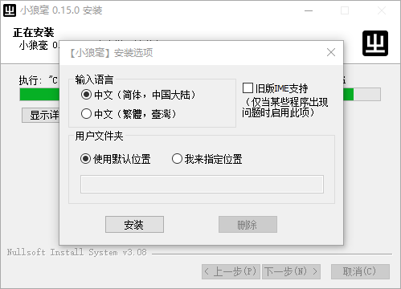

### 4.3.3 [Option](https://github.com/ChineseInputMethod/weasel/blob/master/doc/4.3%20WeaselSetup/4.3.3%20Option/InstallOptionsDlg.cpp.md)

第一次运行安装程序，会弹出安装选项模式对话框。



#### 4.3.3.1 InstallOptions

在对话框类`OnInitDialog`方法中，为控件设置参数。
第一次安装输入法，相应控件处于可选状态。
若曾经安装过输入法，则相应控件处于失效状态。

```CPP
LRESULT InstallOptionsDialog::OnInitDialog(UINT, WPARAM, LPARAM, BOOL&) {
	cn_.Attach(GetDlgItem(IDC_RADIO_CN));
	tw_.Attach(GetDlgItem(IDC_RADIO_TW));
	remove_.Attach(GetDlgItem(IDC_REMOVE));
	default_dir_.Attach(GetDlgItem(IDC_RADIO_DEFAULT_DIR));
	custom_dir_.Attach(GetDlgItem(IDC_RADIO_CUSTOM_DIR));
	dir_.Attach(GetDlgItem(IDC_EDIT_DIR));

	CheckRadioButton(IDC_RADIO_CN, IDC_RADIO_TW,
		(hant ? IDC_RADIO_TW : IDC_RADIO_CN));
	CheckRadioButton(IDC_RADIO_DEFAULT_DIR, IDC_RADIO_CUSTOM_DIR,
		(user_dir.empty() ? IDC_RADIO_DEFAULT_DIR : IDC_RADIO_CUSTOM_DIR));
	dir_.SetWindowTextW(user_dir.c_str());

	cn_.EnableWindow(!installed);
	tw_.EnableWindow(!installed);
	remove_.EnableWindow(installed);
	dir_.EnableWindow(user_dir.empty() ? FALSE : TRUE);

	ok_.Attach(GetDlgItem(IDOK));
	if (installed) {
		CString str;
		str.LoadStringW(IDS_STRING_MODIFY);
		ok_.SetWindowTextW(str);
	}

	ime_.Attach(GetDlgItem(IDC_CHECK_INSTIME));
	if (installed)
		ime_.EnableWindow(FALSE);

	CenterWindow();
	return 0;
}
```

>该函数的安装ime输入法部分有待调整。若用户第一次安装输入法时，没有选中ime多选框，则以后再也无法安装ime输入法。